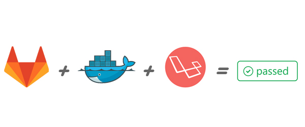

# Gitlabby Dockerish Laravel

> What happens when you Dockerize your Laravel testing environment and throw it at Gitlab CI?

	

This repository includes several files required to run the Gitlab CI on your GitLab Laravel repository. The Docker container is pre-packaged with Laravel vendor dependecies, which reduces the number of files required to be downloaded. 

It pulls a Docker image from [this repository](https://github.com/GIANTCRAB/php-laravel-env).

## Support

To switch between Laravel versions, change this repository's branch. Master branch will always have the latest image. 

| Software | Version |
| :---: | :---: |
| PHP | 7 / 7.1 |
| Laravel | 5.3 / 5.4 |
| MySQL | 5.5 |

## Translations

Currently this repository is available in only two languages, feel free to translate the instructions to other languages and even improve those that already exist.

| Language | 
| :---: | 
| English | 
| [Español](README_ES.md) |

## Get Started

There are two ways which this can be used -- for continuous integration and continuous deployment. 

### Continuous Integration

|Chapters|
| --- | 
| [I. Introduction](/en/continuous-integration/introduction.md) | ... |
| [II. Installation](/en/continuous-integration/installation.md) | ... |

### Continuous Deployment

| Chapters |
| --- |
| [I. Introduction](/en/continuous-deployment/introduction.md) | 
| [II. Methods](/en/continuous-deployment/methods.md) |
